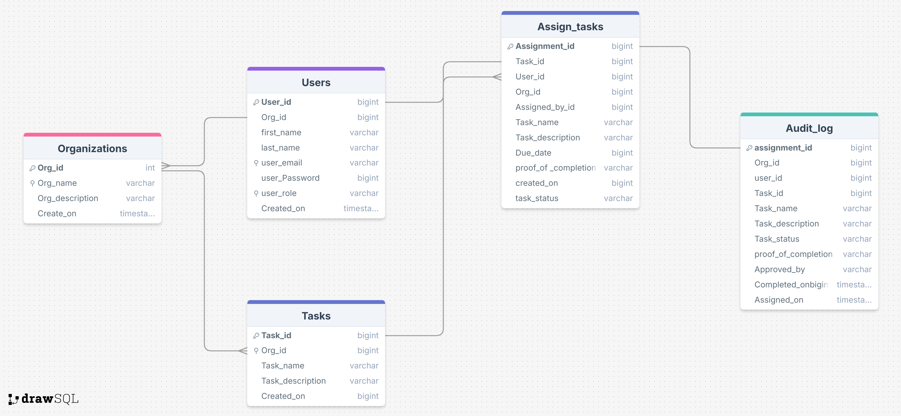

# task-manager-fastapi

A robust task management API built with FastAPI, SQLAlchemy, and PostgreSQL. This project enables organizations to efficiently manage users, tasks, and assignments with modern best practices.

## Features

- Organization management (create, list, retrieve)
- User management (create, list, retrieve, filter by organization)
- Task management (CRUD for tasks, assign to users/organizations)
- Task assignment and completion tracking (with file uploads as proof)
- Password hashing for user security
- Modular code structure with routers and models
- Rate limiting and security best practices
- Celery integration for background task processing (e.g., archiving, deletion)

## Project Structure

```
app/
  main.py           # FastAPI app entry point
  database.py       # Database connection and session
  utils.py          # Utility functions (e.g., password hashing)
  core/
    oauth2.py       # Handles tokenization and verification
  models/
    db_models.py    # SQLAlchemy ORM models
    schemas.py      # Pydantic schemas for validation
    config.py       # Settings management
  routers/
    auth.py         # Authentication endpoints
    assign_tasks.py # Assign tasks (admin only), complete task endpoints (file uploads, status changes)
    org.py          # Organization endpoints
    user.py         # User endpoints
    task.py         # Task endpoints
  tests/            # Pytest-based test suite
  redis_connection.py # Redis connection for rate limiting and Celery
```

## Getting Started

### Prerequisites

- Python 3.10+
- PostgreSQL database
- Redis (for rate limiting and background tasks)
- (Optional) Create a `.env` file for DB and Redis credentials

### Installation

1. Clone the repository:
   ```bash
   git clone <repo-url>
   cd task-manager-fastapi
   ```

2. Install dependencies:
   ```bash
   pip install -r requirements.txt
   # or, if requirements.txt is missing:
   pip install fastapi uvicorn sqlalchemy psycopg2-binary python-dotenv passlib[bcrypt] pydantic-settings celery redis slowapi
   ```

3. Set up your PostgreSQL and Redis instances, and update the connection strings in `app/database.py` and `app/redis_connection.py` or use a `.env` file.

### Running the App

Start the FastAPI server:
```bash
uvicorn app.main:app --reload
```

Start the Celery worker (for background tasks):
```bash
celery -A app.core.celery_worker.celery_app worker --loglevel=info
```

Visit [http://127.0.0.1:8000/docs](http://127.0.0.1:8000/docs) for the interactive API documentation.

## API Endpoints

- `GET /org` - List all organizations
- `POST /org` - Create a new organization
- `GET /org/{org_id}` - Get organization by ID
- `GET /user` - List all users
- `POST /user/create` - Create a new user
- `GET /user/{user_id}` - Get user by ID
- `GET /user/organization/{org_id}` - List users in an organization
- `GET /assigned/` - List all tasks assigned to the current user
- `POST /assigned/` - Assign a task (admin only)
- `PATCH /assigned/{assignment_id}/status` - Update task status and upload proof of completion
- `PATCH /audit-log/approve/{assigned_id}` - Approve a completed task (admin only)

## Database Schema



## License

MIT


